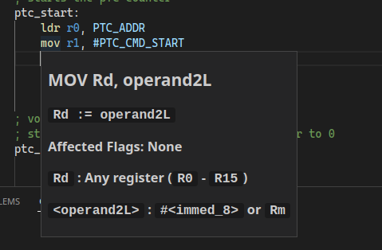

# P16

P16 Assembly extension for [Visual Studio Code](https://code.visualstudio.com).  
This extension was made to be used by students in the [Computer Architecture](https://www.isel.pt/leic/arquitetura-de-computadores) class at [Instituto Superior de Engenharia de Lisboa (ISEL)](https://www.isel.pt) university.

## Features

### Syntax Highlighting

### Live error messages

### Documentation on hover

### Built in compiler

## Requirements

**P16 compiler** (`assets/pas.exe` if windows) in your `$PATH` or in the same folder as the program you are compiling.

## Extension settings
- `p16.executablePath` : Your P16 compiler executable path (e.g: `H:\\p16\\pas.exe`).

## Recommended extensions

- [Error Lens](https://marketplace.visualstudio.com/items?itemName=usernamehw.errorlens)

-----------------------------------------------------------------------------------------------------------

